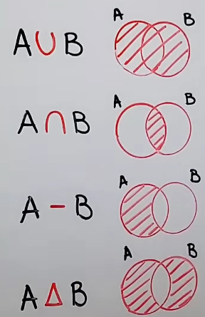

# Operations with Sets in Math 

1. Union of sets 
2. Intersection of sets
3. Set difference  
4. Symmetric set difference

> It works as Python

# Subset and Superset

A subset is a set whose elements are all contained in another set, while a superset is a set that contains all the elements of another set.